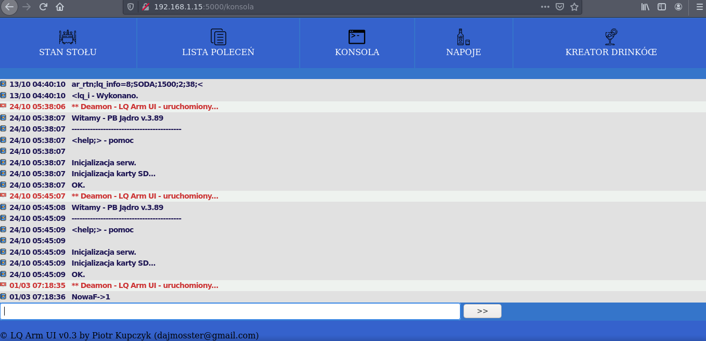

# LQArmRPI-UI
It is prototype of Web GUI for my Electronic project (LQArm) but finally I choosed Qt, C++ and QML for my GUI.
 I do not develop this anymore. 

It's using Python, PySerial, Flask framework, PostgreSQL database, ninja2 templates (flask cooperation).

